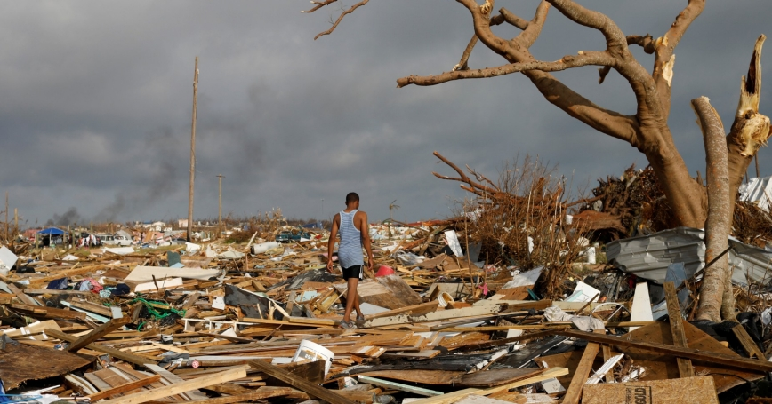
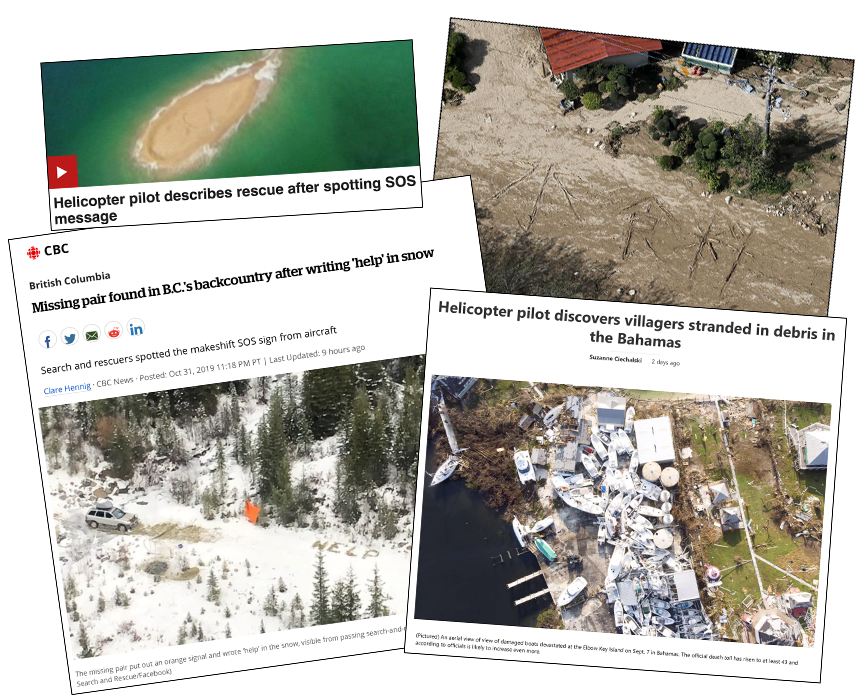
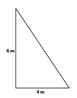
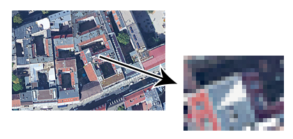
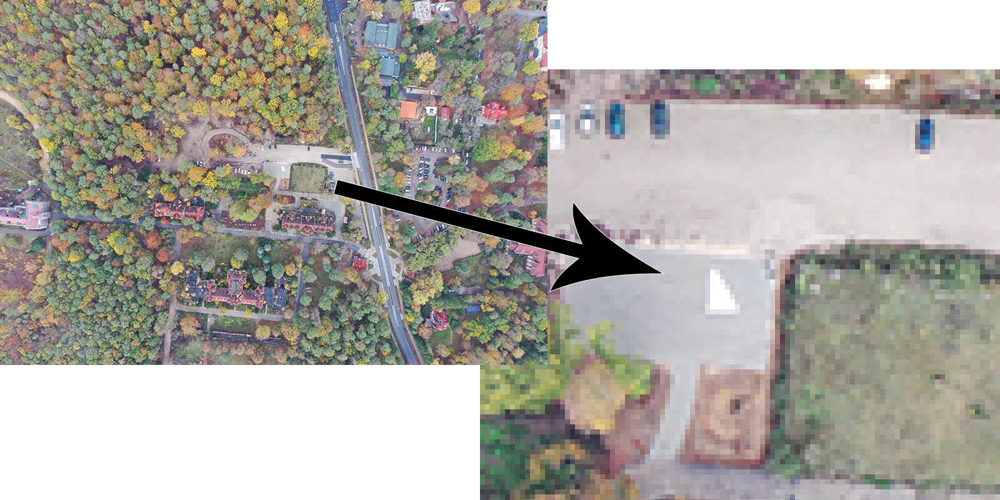

# SVESADS

### Simple Visual Emergency Signal for Automated Detection from Space

&nbsp;

Natural disasters can be awe-inspiring. I guess it's different for everyone, but no natural disaster impresses me more than a hurricane. The sheer size of the destruction, the flattened houses, the flooding. People with no roof over their head, no access to water or food, power and communications cut off, sometimes for weeks. 

Followed some time after by rescue workers looking through the rubble for people that had stayed behind and now need help.

As I was following the aftermath of hurricane Dorian recently, rescue workers were again frantically searching a relatively wide area (in the Bahamas this time) for survivors. It seemed to be a painstaking process, searching from the ground as well as from helicopters and planes.

And while this was playing out, I was browing the web and looking at some satellite images of the impacted area. We now apparently have color images at 70 cm resolution, multiple times a day. And then it hit me: wouldn't it be cool if survivors below could somehow signal via these images that they needed help?

It seems clear to me that people in cities and towns can find help or at least make their presence known simply because there are more people around them. It's the people in rural and other more sparsely populated areas that are likely to need to signal for help. 

&nbsp;

## The signal

So what we're looking for is a way to signal that help is needed, to be seen on satellite images. Here's some thoughts on this signal, in no particular order and with no guarantee that these all hold true.

* Very regularly taken (multiple times a day in some cases) satellite images seem to be available for disaster areas, presently at a resolution where each pixel represents 70cm x 70cm (27" x 27") on the ground.

* The space the suvivor has to make this signal may be as little as a roof in a flooded area, so let's say that is on the order of 7 x 7 meters. That means the signal has to be recognisable at as little as 10x10 pixels.

* Ideally survivors would be able to create the signal from a wide range of materials that might be available to them.

* Survivors will probable not have available materials in various colors, and satellite images may not be color-corrected and taken at differing times of day and in various reflective circumstances. A monochrome signal that simply has to contrast with the environment may make sense. 

* When it comes to recognising a signal that is both simple and low-resolution, there will unavoidably be false positives. Some large fraction of these will be features of buildings and or landscape that were also present pre-disaster. IF pre-disaster images are available, one would expect many of these false positives can be excluded. 
 
&nbsp;

## Experimenting: the triangle

I decided to experiment with a very simple shape at the minimal size I though might be automatically detectable. A rectangle is what seems easiest since most materials people would have on hand are rectangular (bed sheets, plastic tarp, etc). But looking at aerial images, it seems there are many rectangles in any built-up environment that would become false positives. So I decided to fold the net over to make a triangle as follows:

To play with the idea, I scaled a Google earth image so that each pixel would be 70 x 70 cm. I then added the triangle shape in Photoshop, so that it would appear on my roof.

The resulting [image](images/whereswaldo.png) is rather large, so we're not showing it inline here. My friend Sascha then ran a very simple [script](files/whereswaldo.py) using python and [opencv](https://pypi.org/project/opencv-python/) to see if he could find the triangle. Turns out that works but as soon as one even slightly relaxes the criteria for the triangle, a lot of false positives happen. (His script works best on a [portion](images/whereswaldo_selected.png) of the image, because otherwise each cycle of testing takes too long.)

This attempt to find shapes is overly simplistic, and can probably be optimised much further using more sophisticated computer vision techniques, more advanced assumptions about the angles in the triangle and machine learning. On the other hand, the script is already cheating a bit by taking out anything that's below a certain lightness, which may not be a realistic assumption. Also the white triangle in this test wasn't actually photographed but photoshopped in; it's center pixels are all exactly the same color.

I decided I needed to look at actual aerial images. So I bought a 4 x 6 meter [white camouflage net](https://www.amazon.de/gp/product/B073H48DRR), got a drone and took some aerial photos of my net folded into a triangle such as this one:

(Here's the [original image](images/drone-triangle-orig.jpg) and the one [scaled down](images/drone-triangle-70cm.png) to 70 cm pixels.)

&nbsp;

## Open questions and next steps

We'll need to learn if we can reliably find this triangle shape without too many false positives or if we need a more complex shape. Many more test images will need to be availbale for computer vision and machine learning people to play with. Given the complexitity of actually tasking 70cm sat images for testing purposes, we may for a while depend on manipulated existing aerial photos and drone images of actual shapes on the ground and scaled so that the pixels are 70 x 70 cm.  

In that case the quest becomes figuring out a simple shape that is hopefully still small enough to still fit on a roof and that can in a pinch be created without fancy measuring procedures or pre-cut materials. It may well be that we need more than the proposed 10x10 pixels to get reliable recognition. For all I know we might learn that the optimal shape to be recognized by software is the human nipple, because of the amount of existing research on the topic.